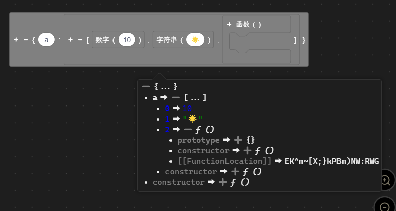
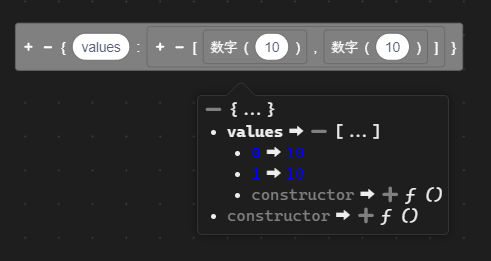
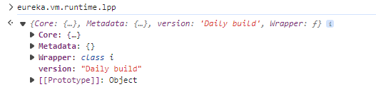
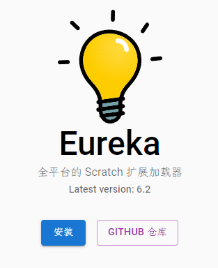
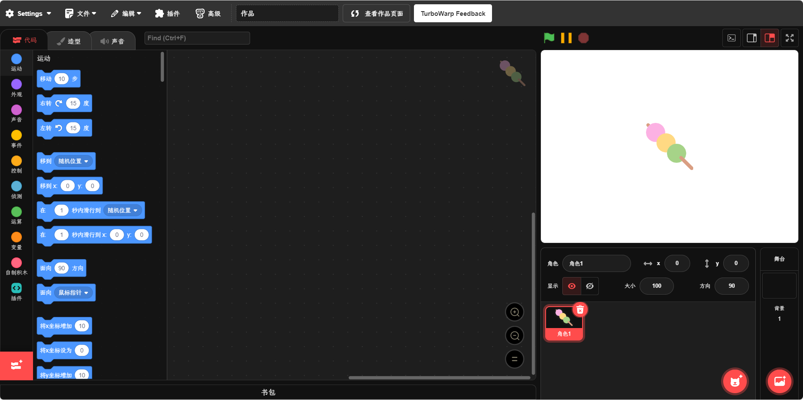
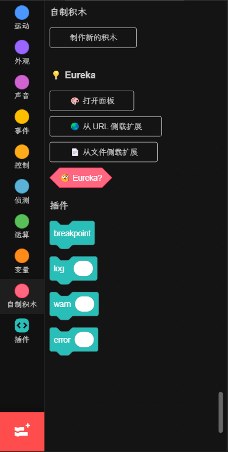
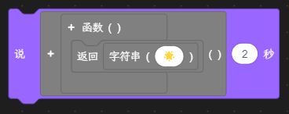

# 🐺 lpp

> 一门由 @FurryR 开发的高级编程语言。

[🇺🇸](./README.md) | 🇨🇳

## 🛠️ 特性

<table>
<tr><td>

### 📃 全新的类型系统

🌟 lpp 引入了一个全新的类型系统到 Scratch 中。由此，您可以创建您自己的复杂对象或类。

</td></tr>
<tr><td>

### 😼 直接构造 JSON

💡 lpp 允许您不使用 `JSON.parse` 而直接构造 JSON。

</td></tr>
<tr><td>

### 👾 友好的调试器

🤖 lpp 提供了一个友好的调试器和错误回溯系统。

</td></tr>
<tr><td>

### 💞 联动

🌎 lpp 导出了它的 API 到 `vm.runtime.lpp`，这样其它的扩展就可以使用它们提供扩展功能了。

</td></tr>
</table>

## 🤔 如何使用

1. 🔽 从 [`Github Actions`](https://github.com/FurryR/lpp-scratch/actions/workflows/ci.yaml) 下载每日构建 (**需要登录**)。 请总是下载最后一个提交。您可以下载 `lpp-debug` 或者 `lpp-release`。将产物解压到一个文件夹中。

1. 💡 下载 [`Eureka`](https://eureka.codingclip.cc/)。请注意您需要先下载 [`Tampermonkey`](https://www.tampermonkey.net/) 或 [`ViolentMonkey`](https://violentmonkey.github.io/get-it/)。点击它们的名字就可以导航到下载页面。

1. 😼 打开一个（受支持的）Scratch 网站 ([`Gandi`](https://cocrea.world/gandi)、[`Co-create world`](https://ccw.site/gandi)、[`scratch.mit.edu`](https://scratch.mit.edu/projects/editor/)、[Turbowarp](https://turbowarp.org/editor), 等等)。

1. 🛠️ 滚动到 `自制积木` 然后您就会看见 `Eureka`。

1. 🐺 使用 `从文件侧载扩展`，在解压的文件夹中选择 `index.global.js`（如果它提示沙盒加载，请选择 **取消**）然后 🎉! Lpp 现在可以用了。

## 📄 文档

<table>
<tr><td>

### ❤️‍🔥 新手起步

🚧 此段落仍在施工中。

</td></tr>
<tr><td>

### 🤖 渐入佳境

🚧 此段落仍在施工中。

</td></tr>
<tr><td>

### 🛠️ 高级文档

🚧 此段落仍在施工中。

- [内嵌类定义](doc/zh-cn/definition/builtin.md)

</td></tr>
</table>

---

_`此项目以 MIT 协议发行。`_

❤️

