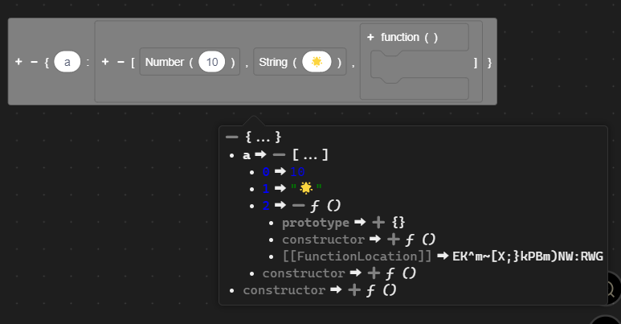
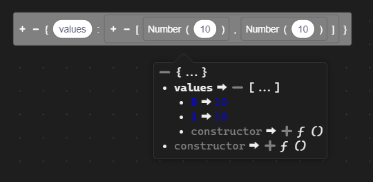
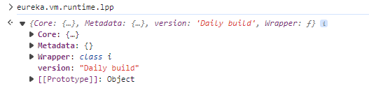
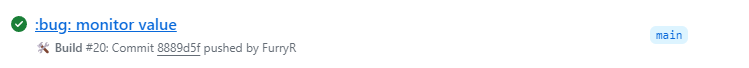
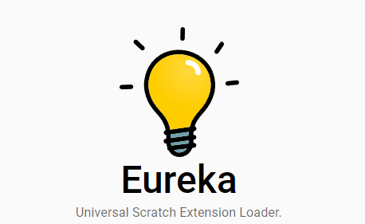
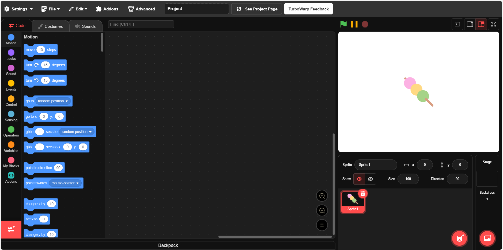
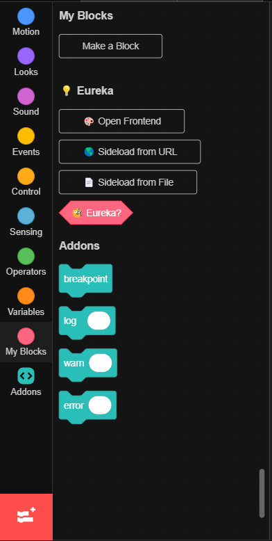
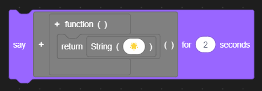

# 🐺 lpp

> A high-level programming language developed by @FurryR.

🇺🇸 | [🇨🇳](./README-zh_CN.md)

## 🛠️ Features

<table>
<tr><td>

### 📃 A brand new type system

🌟 lpp adds a new type system to Scratch. By that you can make your own objects or classes.

</td></tr>
<tr><td>

### 😼 Direct JSON construction

💡 lpp allows you to construct JSON directly without using `JSON.parse`.

</td></tr>
<tr><td>

### 👾 Friendly debugger

🤖 lpp provides a friendly debugger and traceback system.

</td></tr>
<tr><td>

### 💞 Collaboration

🌎 lpp exports its APIs to `vm.runtime.lpp` so other extensions could use them to provide extended functionalities.

</td></tr>
</table>

## 🤔 How to use

1. 🔽 Download lpp daily build from [`Github Actions`](https://github.com/FurryR/lpp-scratch/actions/workflows/ci.yaml) (**requires login**). Please always download latest commit. You can download either `lpp-debug` or `lpp-release`. Decompress the artifact into a folder.

1. 💡 Download [`Eureka`](https://eureka.codingclip.cc/). Please note that you need to install [`Tampermonkey`](https://www.tampermonkey.net/) or [`ViolentMonkey`](https://violentmonkey.github.io/get-it/) first. Click on the names to navigate to its install page.

3. 😼 Open a (supported) Scratch website ([`Gandi`](https://cocrea.world/gandi), [`Co-create world`](https://ccw.site/gandi), [`scratch.mit.edu`](https://scratch.mit.edu/projects/editor/), [Turbowarp](https://turbowarp.org/editor), etc.).

4. 🛠️ Scroll to `My Blocks` and you will see `Eureka`.

5. 🐺 Use `Sideload from File`, select `index.global.js` in the decompressed folder (if it asks you about sandbox, click **Cancel**) and 🎉! Lpp is ready to use.

## 📄 Documentation

<table>
<tr><td>

### ❤️‍🔥 Getting started

🚧 This section is still working in progress.

</td></tr>
<tr><td>

### 🤖 Getting deeper

🚧 This section is still working in progress.

</td></tr>
<tr><td>

### 🛠️ Advanced documentation

🚧 This section is still working in progress.

- [Builtin definitions](doc/en-us/definition/builtin.md)

</td></tr>
</table>

---

_`This project is licensed under the LGPL-3.0 license.`_

❤️

