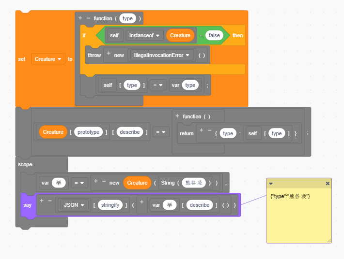
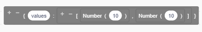
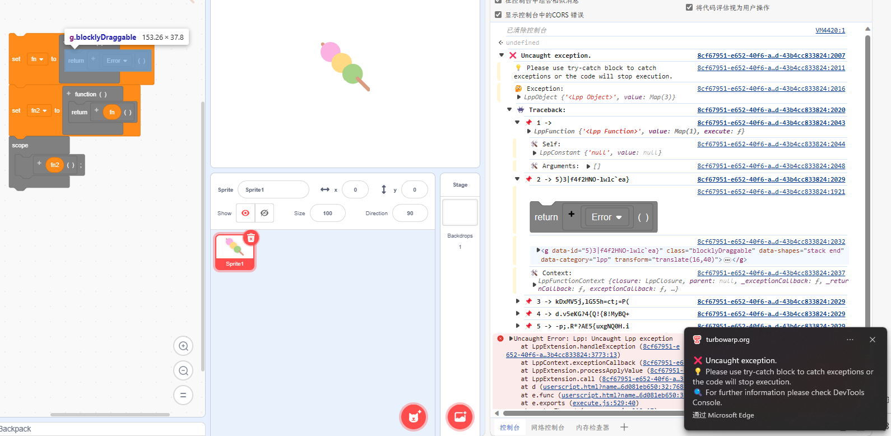
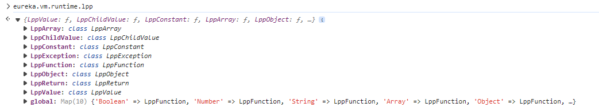
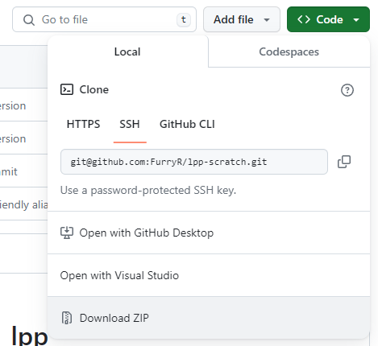
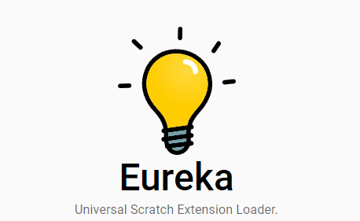
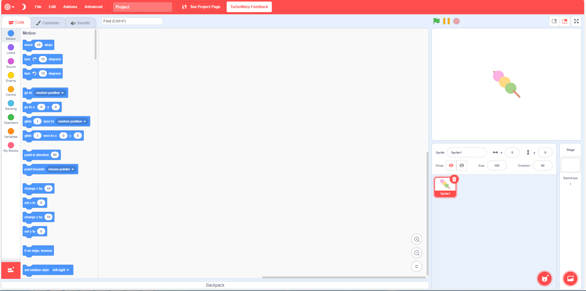
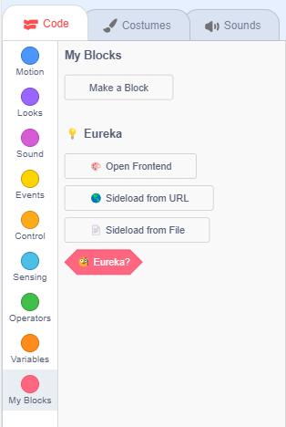
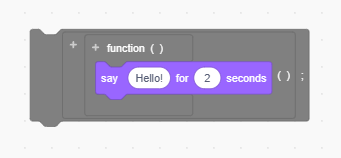

# 🐺 lpp

> A high-level programming language developed by @FurryR.

## 🛠️ Features

<table>
<tr><td>

### 📃 A brand new type system

🌟 lpp adds a new type system to Scratch. By that you can make your own objects or classes.

</td></tr>
<tr><td>

### 😼 Direct JSON construction

💡 lpp allows you to construct JSON directly without using `JSON.parse`.

</td></tr>
<tr><td>

### 👾 Friendly debugger

🤖 lpp provides a friendly debugger and traceback system.

</td></tr>
<tr><td>

### 💞 Collaboration

🌎 lpp exports its APIs to `vm.runtime.lpp` so other extensions could use them to provide extended functionalities.

</td></tr>
</table>

## 🤔 How to use

1. 🔽 Download lpp from `GitHub`. You can click `Download ZIP` to download compressed version if you are using web client. Decompress it to a folder.

1. 💡 Download [Eureka](https://eureka.codingclip.cc/). Please note that you need to install [`Tampermonkey`](https://www.tampermonkey.net/) or [`ViolentMonkey`](https://violentmonkey.github.io/get-it/) first. Click on the names to navigate to its install page.

3. 😼 Open a (supported) Scratch website ([Gandi](https://cocrea.world/gandi), [Co-create world](https://ccw.site/gandi), [scratch.mit.edu](https://scratch.mit.edu/projects/editor/), [Turbowarp](https://turbowarp.org/editor), etc.).

4. 🛠️ Scroll to `My Blocks` and you will see `Eureka`.

5. 🐺 Use `Sideload from File`, select `src/main.js` in the decompressed folder and 🎉! Lpp is ready to use.

---

_`This project is licensed under the MIT license.`_

❤️

